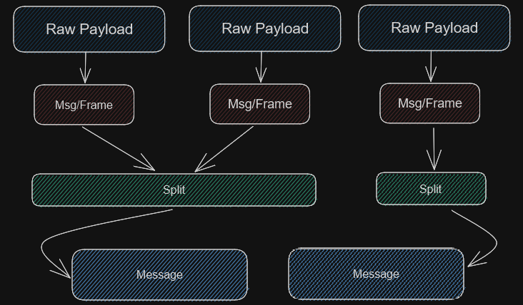

# TCP Protocol Documentation
Compared to the UDP implementation, the TCP protocol is realatively simple, only retaining necessary information for framing, compression, and encryption. However comes with the following caveats:
- Packets sent, are garaunteed to be received in the order they were sent, at the cost of extra overhead.
- All packets need to be acknowledged in ORDER, if a packet is sent out of order it will be refused until the previous packet is acknowledged.
- Generally slower due to the ACK overhead and ordering but comes with the benefit of being reliable.

The TCP protocol is comprised of the following components:
- [Framing](#framing)
- [Messages](#messages)
- [Splits](#splits)

The following diagram should help you visualize the TCP protocol:

## Framing
A frame is a single packet that is sent over the network containing a underlying message. 